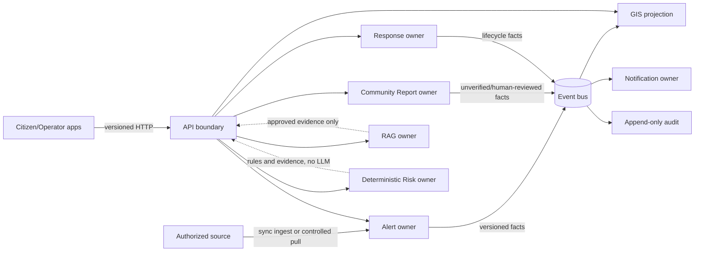

# ADR-001: Microservices, data ownership và ranh giới giao tiếp

- **Status:** Accepted for contract foundation
- **Date:** 2026-07-24
- **Decision owners:** Model 1 / Coordinator review
- **Task:** M1-001
- **Gate:** G1 → G2
- **Scope:** Kiến trúc logic; chưa quyết định cloud hoặc topology production
- **Data environment:** Synthetic cho đến khi legal/data gate tương ứng được phê duyệt

## Bối cảnh

SafeZone AI phải cung cấp cảnh báo chính thống, GIS và điểm tránh trú đã xác minh, báo cáo cộng đồng, hỗ trợ cứu trợ, thông báo, RAG có trích dẫn, risk deterministic và audit. Các miền có vòng đời, quyền truy cập, yêu cầu lưu giữ và safety boundary khác nhau.

Hệ thống phải bảo đảm:

1. `official_alert`, `system_analysis` và `community_report` là các loại dữ liệu riêng.
2. Nội dung cảnh báo chính thức bất biến; correction, cancel và expiry tạo phiên bản hoặc lifecycle transition mới.
3. Báo cáo cộng đồng mặc định `unverified`; AI không được xác minh.
4. Risk Engine deterministic, versioned và không phụ thuộc LLM.
5. RAG chỉ dùng tài liệu hợp lệ và trả citation hoặc refusal cho hướng dẫn quan trọng.
6. Dữ liệu GPS, sức khỏe, household và media được tối thiểu hóa, mã hóa và giới hạn theo locality/purpose.
7. Event delivery được giả định at-least-once, nên duplicate, replay và reorder là hành vi bình thường cần xử lý.

Một cơ sở dữ liệu dùng chung hoặc giao tiếp đồng bộ cho mọi luồng sẽ làm mờ ownership, tăng coupling và có thể khiến lỗi phụ trợ chặn việc đọc cảnh báo. Ngược lại, tách mỗi thao tác thành service/event riêng ngay từ đầu sẽ tạo chi phí vận hành không cần thiết.

## Quyết định

Áp dụng **domain-aligned services với data ownership độc quyền**, contract-first và triển khai theo vertical slice. Ranh giới dưới đây là ranh giới logic; có thể triển khai chung process trong giai đoạn đầu nếu vẫn giữ module, schema/role và contract boundary, sau đó tách deployment mà không đổi semantics.

### Bounded contexts và ownership

| Context/service logic | Dữ liệu sở hữu | Trách nhiệm chính | Không được làm |
|---|---|---|---|
| Identity & Profile | account linkage, session/device, role/locality grants, consent ledger, encrypted household profile | OIDC adapter, RBAC/locality, consent và data-right workflows | Không cấp quyền dựa trên bảng của service khác |
| Alert | source registry, immutable raw alert, provenance, signature result, alert versions/lifecycle, quarantine | ingest, validate, deduplicate, correction/cancel/expiry | Không sửa raw official content; không coi nguồn chưa được phép là official |
| GIS & Shelter | administrative geometry, versioned GIS datasets, roads, shelter verification/status/capacity history | spatial query và stale policy | Không suy đoán shelter hoặc public routing khi road state chưa verified |
| Community Report | report, media metadata, verification history, clustering provenance | nhận report, moderation transition và deterministic clustering | Không cho AI/system chuyển report thành `verified` |
| Response | assistance request, relief case, team/shift, resource ledger | assignment, transfer, SLA và conflict-safe commands | Không để AI tự dispatch hoặc đóng case có thẩm quyền |
| Notification | preferences/consent, audience snapshot, delivery ledger, provider receipt | gửi theo alert validity, opt-out và quota | Không đồng nhất `accepted` với `delivered`; không gửi mới sau cancel/expiry |
| RAG | approved document metadata, raw hash, chunks/lineage, index versions, feedback review | governed retrieval, citation và refusal | Không retrieve nguồn inactive/expired/wrong-locality; không ra quyết định có thẩm quyền |
| Risk | rule drafts/versions, approved activation records, simulation results | deterministic evaluation và evidence | Không gọi LLM; không tự activate rule |
| Audit & Operations Control | append-only audit chain, feature flags, approval records, incident/status metadata | truy vết privileged actions và kill switches | Không lưu raw secret/PII; không sửa/xóa lịch sử để rollback |

Tên service vật lý và việc gộp deployment sẽ được quyết định khi có consumer và tải thực tế. Không tạo service chỉ vì bảng trên liệt kê một context.

`API boundary`/gateway chỉ làm routing, xác thực transport, rate limit và correlation; nó không sở hữu nghiệp vụ, không nối dữ liệu giữa các schema và không thay owner ra quyết định authorization cuối cùng. Identity là owner của grant/consent, còn mỗi domain owner phải tự kiểm tra action, resource, locality và purpose tại thời điểm xử lý command.

### Quy tắc data ownership

1. Mỗi context là writer duy nhất cho dữ liệu nghiệp vụ của mình và dùng database role/schema riêng.
2. Service không đọc trực tiếp bảng, view hoặc replica thuộc context khác.
3. Cần dữ liệu tức thời thì gọi versioned API của owner; cần local read model thì subscribe versioned event và lưu projection do chính consumer sở hữu.
4. Projection chỉ là bản sao phục vụ đọc, không trở thành source of truth và phải lưu source version/offset để reconciliation.
5. Thay đổi nhiều context không dùng distributed transaction. Owner commit trạng thái và outbox trong một local transaction; downstream xử lý bất đồng bộ.
6. Object storage cũng tuân theo ownership: object key/bucket policy không cho service khác sửa raw official object hoặc restricted media.
7. Public projection phải loại exact GPS, contact, household member và shelter resident trừ khi endpoint, purpose và authorization cho phép rõ ràng.

### Giao tiếp đồng bộ

Dùng versioned HTTP API khi caller cần phản hồi ngay để hoàn tất user command/query và có thể xử lý rõ timeout hoặc dependency unavailable.

Các trường hợp phù hợp:

- Kiểm tra identity, role và locality cho privileged command.
- Đọc alert/GIS/shelter hiện hành từ owner hoặc gateway projection.
- Tạo command cần trả resource ID, idempotency result hoặc validation error ngay.
- Query RAG/risk do người dùng khởi tạo; failure phải trả trạng thái unavailable/refusal, không tự thay bằng suy đoán.

Yêu cầu:

- OpenAPI là source of truth; timestamp ISO 8601 có timezone, ID opaque và lỗi dùng common error contract.
- Command có side effect hỗ trợ idempotency key khi retry có thể tạo duplicate.
- Timeout hữu hạn, propagation của correlation/trace ID và retry chỉ với lỗi transient/an toàn.
- Không retry mù command không idempotent; không tạo chuỗi gọi đồng bộ sâu.
- Authorization được kiểm tra tại edge và owner; locality/purpose không chỉ dựa vào client.
- Dependency failure không được làm thay đổi safety semantics. Ví dụ RAG lỗi thì refuse/static approved guidance, không dùng LLM không kiểm soát.

### Giao tiếp bất đồng bộ

Dùng event khi producer đã commit một fact, nhiều consumer cần phản ứng, hoặc công việc không cần chặn request gốc.

Các trường hợp phù hợp:

- Alert issued/updated/corrected/cancelled/expired.
- Report created hoặc human verification changed.
- Shelter/road verification or stale status changed.
- Relief/assistance transition và resource ledger facts.
- Notification scheduling/delivery receipt.
- Corpus/rule version approved, activated, withdrawn hoặc rolled back.
- Append-only audit ingestion và reconciliation triggers.

Yêu cầu:

- Event envelope theo AsyncAPI gồm `event_id`, `event_type`, `schema_version`, `aggregate_id`, `aggregate_version`, `occurred_at`, `received_at`, `source`, `trace_id`.
- Producer ghi business state và transactional outbox trong cùng transaction.
- Consumer dùng inbox/dedup theo `event_id`, xử lý idempotent và theo dõi `aggregate_version` để nhận biết duplicate/reorder/gap.
- Retry exponential backoff có giới hạn; lỗi không thể xử lý vào DLQ với reason không chứa payload nhạy cảm.
- Replay không tạo side effect trùng. Notification phải có suppression/delivery ledger; audit giữ event identity.
- Event là fact đã xảy ra, không dùng tên cũ cho semantics mới. Breaking change dùng topic/version mới và migration window được phê duyệt.
- Event không chứa raw token, exact sensitive GPS, health detail hoặc media bytes; consumer lấy dữ liệu qua authorized API khi thực sự cần.

### Command, event và query

- **Command:** yêu cầu owner thử thay đổi trạng thái; có thể bị từ chối và cần actor/locality/reason khi privileged.
- **Event:** fact bất biến sau khi owner commit; không phải yêu cầu consumer phê duyệt thay producer.
- **Query:** đọc không gây side effect nghiệp vụ; có thể phục vụ từ owner hoặc projection có freshness metadata.

Không phát event mang ý nghĩa mệnh lệnh như “evacuate”, “close road”, “verify report” hoặc “dispatch team” từ AI. Các transition có thẩm quyền phải bắt đầu từ actor được phép, qua policy/approval và audit.

### Ma trận ranh giới tích hợp

Ma trận này xác định hướng mặc định; contract chi tiết và tên endpoint/event thuộc `M1-002`/`M1-003` trở đi.

| Producer/owner | Consumer | Dữ liệu qua ranh giới | Cơ chế mặc định | Consistency/failure rule |
|---|---|---|---|---|
| Identity & Profile | Mọi domain owner | actor, role/locality grant, consent/purpose decision tối thiểu | Sync cho privileged command; event cho grant/consent changed | Owner fail closed với write đặc quyền; không cache grant quá validity |
| Alert | GIS, Notification, Risk, Audit | alert identity, official lifecycle/version, validity, coarse locality/geometry reference | Event fact; sync query khi cần bản current authoritative | Duplicate/reorder theo aggregate version; cancel/expiry ưu tiên reconciliation |
| GIS & Shelter | Alert/API, Response, Risk, Notification | dataset/version, verified geometry/shelter/road status, freshness | Sync query cho quyết định tức thời; event để cập nhật projection | Thiếu/stale verification phải trả unknown/stale, không suy đoán current |
| Community Report | Risk, Response, Audit | report identity, coarse location, `unverified` hoặc human-reviewed transition, provenance | Event fact; authorized sync detail query khi cần | AI suggestion không được xuất hiện như verification fact |
| Response | Notification, Audit | assistance/relief/team/resource transition tối thiểu | Event fact sau local commit | Consumer không được tự hoàn tất hoặc đảo transition của Response |
| Notification | Audit/Operations | audience snapshot reference, acceptance/delivery outcome, suppression reason | Event fact và authorized query | Provider retry không tạo lần gửi logic mới; không phát raw recipient/token |
| RAG | API/Audit | answer/refusal, citation document/version/chunk reference, safety outcome | Sync request/response; audit event tối thiểu | Timeout hoặc thiếu evidence dẫn đến refusal/degraded, không fallback suy đoán |
| Risk | API/Audit | score/category, factors, evidence references, rule version, disclaimer | Sync evaluation; event khi rule lifecycle đổi | Cùng input + rule version cho cùng output; không gọi LLM/downstream để tính điểm |
| Audit & Operations Control | Domain owners | approved feature/kill-switch state hoặc approval reference | Sync check khi action trọng yếu; event cho state changed | Không dùng audit store làm source of truth nghiệp vụ; fail-safe theo policy từng action |

Không chuyển payload đầy đủ chỉ để “phòng khi cần”. Event chỉ mang dữ liệu tối thiểu cho consumer đã xác định; dữ liệu nhạy cảm bổ sung phải được lấy từ owner qua API có authorization, purpose và audit.

## Ranh giới luồng chính

## Consistency và failure behavior

- Trong một aggregate của owner: strong consistency bằng local transaction và optimistic concurrency/version.
- Giữa contexts: eventual consistency qua events; API/read model phải trả `updated_at`, version hoặc stale state khi freshness ảnh hưởng quyết định.
- Consumer phát hiện gap phải dừng áp dụng aggregate liên quan, đánh dấu degraded và reconciliation với owner; không tự đoán state bị thiếu.
- Kafka/event bus unavailable: producer vẫn có thể commit local state + outbox nếu policy cho phép; dispatcher retry sau. Luồng cần downstream tức thời phải trả trạng thái pending/degraded rõ ràng.
- Projection unavailable: ưu tiên plain-text official alert từ Alert owner; không nâng dữ liệu cache stale thành current.
- Rollback deployment không xóa outbox, inbox, audit, provenance hoặc version history.

## Contract và versioning

- OpenAPI cho HTTP, AsyncAPI cho channels/envelope và JSON Schema cho payload dùng chung.
- Contract và generated TypeScript SDK dùng SemVer; Model 1 là producer duy nhất.
- Additive field mặc định optional. Xóa/đổi tên/đổi meaning/type/required là breaking.
- Enum addition phải kiểm tra exhaustive consumers; nếu có thể làm consumer hỏng thì được xử lý như breaking trong milestone.
- Contract source, mock fixtures, compatibility report và generated SDK phải cùng milestone.

## Security, privacy và observability

- Workload identity, least privilege và network policy sẽ giới hạn service-to-service access.
- Sensitive fields mã hóa khi lưu/truyền; log chỉ dùng opaque ID, coarse locality hoặc redacted metadata.
- Mọi request/event truyền `trace_id`/correlation ID; metrics gồm latency, error, outbox lag, consumer lag, retry và DLQ count nhưng không gắn PII/GPS chi tiết làm label.
- Privileged transition ghi actor, role, locality, reason, before/after hash và approval reference; audit query/export bị giới hạn.
- Legal gate chưa đạt thì chỉ synthetic/sandbox và adapter production giữ disabled.

## Các phương án đã cân nhắc

### Modular monolith với một database role chung

Không chọn. Có thể giảm chi phí ban đầu nhưng không cưỡng chế ownership, dễ cross-context join/write và làm official/audit immutability khó kiểm chứng. Việc gộp process vẫn được phép, nhưng schema/role/module contract phải độc lập.

### Microservice cho mọi capability ngay từ đầu

Không chọn. Tạo vận hành phức tạp và abstraction chưa có consumer. Chỉ tách deployment khi vertical slice, scaling, security isolation hoặc availability chứng minh nhu cầu.

### Mọi giao tiếp đều đồng bộ

Không chọn. Tăng coupling, tạo failure cascade và không phù hợp fan-out/replay/reconciliation.

### Mọi giao tiếp đều qua event

Không chọn. User command cần validation/result rõ ràng; authorization và query tương tác không nên biến thành choreography khó quan sát.

### Database/CDC làm integration contract

Không chọn. Schema lưu trữ nội bộ không phải public contract; CDC có thể dùng như cơ chế triển khai outbox được kiểm soát nhưng payload vẫn phải theo event contract versioned.

## Hệ quả

### Tích cực

- Safety boundary và source of truth rõ ràng.
- Có thể scale, deploy hoặc phục hồi từng context theo nhu cầu.
- Event replay/reconciliation và audit có semantics xác định.
- Frontend chỉ phụ thuộc contract/SDK, không phụ thuộc storage topology.

### Chi phí và rủi ro

- Cần outbox/inbox, schema registry, compatibility tests và observability từ sớm.
- Eventual consistency yêu cầu UI/API biểu diễn pending/stale/degraded.
- Projection và reconciliation tăng storage/logic.
- Tách deployment quá sớm vẫn là rủi ro; phải review theo vertical slice.

## Guardrails kiểm chứng

Các task tiếp theo phải chứng minh:

1. Không có cross-service table access.
2. Event consumer có duplicate, replay và reorder/gap tests.
3. Official raw content và version chain không bị mutation.
4. Không có đường system/AI tự verify report, dispatch, close road hoặc activate risk rule.
5. Logs/events không chứa secret hoặc raw sensitive payload.
6. Contract validation, compatibility và SDK generation pass tại mỗi milestone.
7. Rollback giữ audit, provenance và pending events để replay.

## Tiêu chí chấp nhận M1-001

| Tiêu chí | Bằng chứng trong ADR |
|---|---|
| Microservice boundary không ép topology sớm | Bounded contexts là ranh giới logic; cho phép gộp process nhưng giữ schema/role/contract |
| Mỗi dữ liệu có một owner ghi duy nhất | Bảng ownership và quy tắc writer duy nhất; cấm table/view/replica access chéo |
| Sync/async có quy tắc lựa chọn và failure semantics | Các mục giao tiếp đồng bộ, bất đồng bộ, ma trận tích hợp và consistency/failure behavior |
| At-least-once không tạo side effect lặp | Transactional outbox, inbox/dedup, aggregate version, retry/DLQ và replay guard |
| Safety boundary không bị giao tiếp liên service làm yếu | Cấm AI verify/dispatch/closure/activation; official immutability; RAG refusal; deterministic risk |
| Contract có đường phát triển tương thích | OpenAPI/AsyncAPI/JSON Schema, SemVer, compatibility và SDK cùng milestone |
| Quyết định có rollback/mitigation | Cho phép gộp deployment; đổi data owner cần ADR/migration/reconciliation riêng |

## Rollback quyết định

Nếu ranh giới gây coupling hoặc vận hành không chấp nhận được, có thể gộp deployment của các context sau architecture review, nhưng không gộp ownership/schema role hoặc bỏ versioned contract. Việc đổi owner dữ liệu cần ADR mới, migration có dual-read/dual-write window được duyệt, reconciliation và compatibility report; không chuyển bằng cách cho service mới đọc trực tiếp bảng cũ.

## Việc được mở khóa

ADR này mở khóa thiết kế common API/event contracts trong `M1-002` và `M1-003`. Nó không cấp quyền scaffold toàn bộ service, chọn cloud, tạo production adapter hoặc dùng dữ liệu thật.
