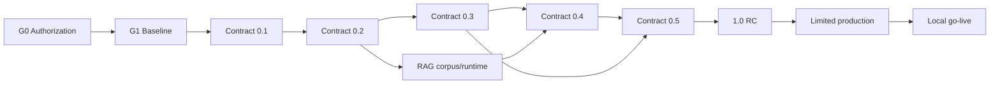

# SafeZone AI — Detailed Execution Plan

## 1. Cách dùng

Tài liệu này là lịch thực thi chi tiết cho hai model trong 12 tháng, giả định sprint 2 tuần. Nó không cấp quyền sửa file; ownership vẫn theo agent/instruction và mỗi lần giao việc phải dùng `TASK_MANIFEST_TEMPLATE.md`.

- Một model chỉ có một task chính `in-progress`.
- Task 0,5–3 ngày; task dài hơn phải tách thành subtask trong tracker nhưng giữ Task ID cha.
- Model 1 merge contract/runtime trước; Model 2 chỉ bắt đầu API-dependent task khi SDK/mock đã phát hành.
- Mỗi sprint có entry, exit, evidence và contingency. Không đạt exit thì không kéo task của sprint sau để che blocker.
- Dữ liệu thật chỉ dùng khi gate trong `LEGAL_DATA_GATES.md` đạt; trước đó dùng synthetic/sandbox.

## 2. Critical path

Critical blockers: source authorization, operator RACI, SDK generation, verified shelter process, approved RAG corpus, notification-provider approval, security remediation và DR drill.

## 3. Lịch 24 sprint

| Sprint | Gate mục tiêu | Model 1 | Model 2 | Handoff/exit bắt buộc |
|---|---|---|---|---|
| S01 | G0/G1 | M1-001, M1-002 | M2-005 UX/IA only; chưa API code | ADR, baseline, ownership CI, source/legal register, IA artifacts |
| S02 | G2 | M1-003→M1-006 | Chờ SDK; chuẩn bị a11y/device matrix | SDK/mock 0.1.0, contract smoke pass |
| S03 | G3 prep | M1-101→M1-103 | M2-001→M2-003 | Auth/error/source primitives chạy với mock |
| S04 | G3 prep | M1-104→M1-108 | M2-004→M2-006 | Identity/privacy slice và frontend test base |
| S05 | G3 prep | M1-201→M1-204 | M2-101→M2-102 với fixture | Immutable raw alert, lifecycle fixture |
| S06 | G3 | M1-205→M1-208 | M2-103, M2-105→M2-106 | Alert contract/provenance/reconciliation pass |
| S07 | G3 | M1-301→M1-304 | M2-104, M2-201→M2-202 | Spatial correctness và consent UI |
| S08 | G3 close | M1-305→M1-310 | M2-203→M2-207 | SDK 0.2.0; shelter/offline degraded flow pass |
| S09 | G4 prep | M1-401→M1-403 | M2-301→M2-303 | Secure upload và offline queue fixtures |
| S10 | G4 prep | M1-404→M1-406 | M2-304→M2-306 | No-auto-verify và reconnect dedup pass |
| S11 | G4 | M1-501→M1-504 | M2-307→M2-308, M2-401→M2-403 | Assistance/relief contract; verification console |
| S12 | G4 | M1-505→M1-509 | M2-404→M2-408 | SDK 0.3.0; provider ledger/two-person approval |
| S13 | G4 close | M1-510→M1-514 | M2-208→M2-210, M2-409→M2-410 | Preferences/emergency contacts/team-resource slice |
| S14 | G5 prep | M1-601→M1-603 | M2-501→M2-503 với mock | Approved corpus only; retrieval trace fixture |
| S15 | G5 prep | M1-604→M1-609 | M2-504, M2-601→M2-603 | Citation/refusal/withdrawal tests pass |
| S16 | G5 | M1-701→M1-705 | M2-505→M2-506, M2-604→M2-606 | Deterministic risk + immutable audit evidence |
| S17 | G5 close | M1-706→M1-710 | M2-607, M2-806→M2-807 | SDK 0.4.0; safety gate report pass |
| S18 | G5.5 prep | M1-901→M1-905 | M2-411→M2-414, M2-801 | Operations/privileged-action workflows |
| S19 | G5.5 | M1-906→M1-910 | M2-802→M2-809 | Reconciliation/admin/incident/kill-switch UX |
| S20 | G5.5 close | M1-911→M1-916 | M2-810→M2-819 | SDK 0.5.0; operations acceptance pack |
| S21 | G6 prep | M1-801→M1-804 | M2-701→M2-704, M2-820→M2-822 | HA/telemetry baseline; system E2E core |
| S22 | G6 | M1-805→M1-809 | M2-705→M2-708, M2-823→M2-826 | SDK 1.0.0-rc, perf/a11y/security evidence |
| S23 | G7 | M1-917→M1-925 | Field rehearsal, training, degraded-mode drills | DR/rollback/kill-switch drills; no P0/P1 |
| S24 | G8 | Limited-production monitoring/remediation | Cohort rollout support/field feedback | Go/no-go report, error budget và post-pilot backlog |

## 4. Entry/exit theo phase

### Phase A — Foundation, S01–S04

**Entry:** G0 artifacts có owner và trạng thái; coordinator baseline đã commit.  
**Exit:** contract/SDK 0.1.0; identity/locality/consent contracts; API client và design primitives; ownership CI chặn file sai scope.  
**Evidence:** ADR, compatibility report, SDK hash, secret scan, synthetic-data declaration, auth negative tests và a11y smoke test.  
**Fallback:** nếu legal/source chưa đạt, chỉ triển khai synthetic fixtures; không tạo adapter production.

### Phase B — Alert/GIS/Offline, S05–S08

**Entry:** SDK 0.1.0 pin; source sandbox hợp lệ.  
**Exit:** SDK 0.2.0; alert lifecycle/provenance; verified shelter/stale; Citizen alert/map/plain-text/offline package.  
**Evidence:** official immutability, dedup/replay, spatial correctness, stale cache, weak-network và public-without-profile tests.  
**Fallback:** MapLibre lỗi phải còn plain-text alerts và verified shelter list; không suy đoán routing.

### Phase C — Community response, S09–S13

**Entry:** identity/locality và offline base ổn định.  
**Exit:** SDK 0.3.0; secure reports, human verification, assistance/relief, notifications, team/resource minimum và Operations core.  
**Evidence:** malware/MIME tests, reconnect dedup, zero auto-verify, provider receipt reconciliation, opt-out và two-person approval.  
**Fallback:** provider chưa được duyệt giữ adapter disabled/sandbox; report vẫn gửi và theo dõi được không media.

### Phase D — Intelligence safety, S14–S17

**Entry:** L3 corpus approved hoặc synthetic evaluation corpus.  
**Exit:** SDK 0.4.0; governed RAG, deterministic risk, audit và Vietnamese safety report.  
**Evidence:** 100% important guidance cited; expired/withdrawn source excluded; forbidden behavior bằng 0; risk reproducible cùng input/version.  
**Fallback:** RAG kill switch trả static guidance; risk unavailable không được thay bằng LLM estimate.

### Phase E — Administration, S18–S20

**Entry:** response/intelligence slices ổn định; privileged roles được định nghĩa.  
**Exit:** SDK 0.5.0; source/GIS/corpus/risk administration, incident, anti-abuse, status và kill switches.  
**Evidence:** cross-locality denial, destructive-action confirmation, two-person approval, rollback, appeal và no-public-PII tests.  
**Fallback:** admin module lỗi chuyển read-only; không bypass bằng database edit thủ công ngoài break-glass runbook.

### Phase F — RC và rollout, S21–S24

**Entry:** tất cả pilot-required capability đạt DoD.  
**Exit:** RC freeze, E2E/perf/a11y/security/DR pass; limited production rồi local go-live có phê duyệt.  
**Evidence:** SLO dashboard, pentest remediation, SBOM/signature, RPO/RTO drill, field scripts, operator sign-off, compatibility matrix.  
**Fallback:** rollback cohort/app/backend/SDK; giữ official alert plain-text và static emergency guidance.

## 5. Task packet bắt buộc

Khi giao một Task ID, coordinator phải điền đầy đủ:

1. **Outcome:** một hành vi kiểm chứng được, không ghi “xây module”.
2. **Input:** exact contract/SDK/fixture/ADR/gate version.
3. **Scope:** exact files/directories; shared-file request tách riêng.
4. **State machine:** states, actor, allowed transition, denied transition, expiry/stale behavior.
5. **Data:** classification, retention, locality, encryption, public projection.
6. **Acceptance:** ít nhất một happy path, unauthorized, duplicate/replay, stale/expiry và rollback case khi áp dụng.
7. **Evidence:** command/job, expected artifact path và reviewer.
8. **Handoff:** consumer task được mở khóa và artifact/hash cần pin.

## 6. Ví dụ task packet — Model 1

### M1-401 — Community report contract

- **Outcome:** API tạo/đọc report luôn khởi tạo `verification_status=unverified`; client không thể gửi `verified`.
- **Depends on:** M1-102, M1-307; L1 approved hoặc sandbox.
- **Inputs:** SDK 0.2.0, locality policy, report retention decision.
- **Deliverables:** OpenAPI schema, errors, idempotency behavior, event schema, fixture và contract tests.
- **Acceptance:** cùng idempotency key trả cùng resource; unauthorized exact-location read bị từ chối; `verified` trong create payload bị reject; public projection loại contact/exact GPS.
- **Evidence:** contract validation, negative tests, generated SDK diff và compatibility report.
- **Rollback:** additive schema only; producer flag off; pin SDK 0.2.0.
- **Blocks:** M2-301, M1-402, M1-404.

### M1-701 — Deterministic risk rules

- **Outcome:** cùng normalized input và rule version luôn trả cùng score/factors, không có LLM/network dependency.
- **Depends on:** M1-205, M1-303, M1-404.
- **Deliverables:** versioned rules schema, validation, evaluator interface, golden fixtures và reproducibility tests.
- **Acceptance:** invalid/unknown/stale evidence bị xử lý theo policy; response có factor/evidence/rule version/disclaimer; dependency scan không có LLM client.
- **Evidence:** golden test hash, repeat-run result và dependency report.
- **Rollback:** deactivate version bằng approved rule lifecycle; giữ audit và previous version.
- **Blocks:** M1-702, M2-505.

## 7. Ví dụ task packet — Model 2

### M2-303 — Offline report queue

- **Outcome:** report tạo offline được lưu với idempotency ID và chỉ tạo một server resource sau reconnect.
- **Depends on:** M2-204, SDK/report fixture 0.3.0.
- **Deliverables:** IndexedDB record/migration, queue worker, status UI và component/E2E tests.
- **States:** draft, queued, sending, sent, failed, conflict, cancelled; luôn hiển thị `unverified` khi chưa có authority response.
- **Acceptance:** reload không mất queue; reconnect lặp không duplicate; user sửa/hủy khi chưa gửi; quota/storage failure có hướng dẫn không mất dữ liệu âm thầm.
- **Accessibility:** status được announce; retry/cancel dùng keyboard; focus không nhảy ngoài ý muốn.
- **Rollback:** service-worker/app artifact rollback với DB migration tương thích ngược.
- **Blocks:** M2-304→M2-306.

### M2-809 — Kill-switch UI

- **Outcome:** operator có quyền xem impact, yêu cầu action và theo dõi approval/result; UI không tự coi request là applied.
- **Depends on:** M1-904→M1-905, SDK 0.5.0.
- **Acceptance:** unauthorized/cross-locality denied; critical action cần second approver khác actor đầu; reason bắt buộc; stale state được refresh trước confirm; audit reference hiển thị.
- **Safety:** không cung cấp nút bypass; failure giữ trạng thái trước đó và hiển thị verified backend result.
- **Evidence:** role matrix, stale/concurrent approval E2E và screen-reader test.

## 8. Daily và sprint ceremony

### Daily handoff

- Task/status, branch/head commit.
- Files changed và files dự kiến hôm nay.
- Input contract/SDK hash.
- Test/evidence mới nhất.
- Blocker, owner và deadline quyết định.
- Contract/shared-file request nếu có.

### Sprint planning

- Chỉ kéo task đạt DoR.
- Giới hạn 5–8 task IDs/model/sprint tùy complexity; không coi range là một task.
- Dành 20% capacity cho tests, integration, documentation và remediation.
- Không đưa post-pilot task vào sprint V1.

### Sprint review

- Demo bằng synthetic/sandbox fixture đã duyệt.
- Đối chiếu acceptance và evidence, không chấp nhận “đã code xong”.
- Kiểm tra contract/SDK/migration/event impact.
- Ghi defect và blocker thành task mới, không mở rộng task đã done.

### Gate review

Coordinator lập go/no-go manifest gồm artifact hashes, test evidence, legal status, known limitations, rollback owner và quyết định có chữ ký/approval record.

## 9. RACI tối thiểu

| Quyết định | Responsible | Accountable | Consulted | Informed |
|---|---|---|---|---|
| Contract/API/event | Model 1 | Coordinator/architect | Model 2, security/privacy | Cả hai model |
| Product UX/copy | Model 2 | Product owner | Domain/safety/accessibility | Model 1 |
| Official source authorization | Data/legal owner | Program owner | Model 1 | Model 2 |
| Risk rule activation | Authorized officials | Risk owner | Model 1, safety | Model 2 |
| RAG corpus approval | Content authority | Domain owner | Legal/safety/Model 1 | Model 2 |
| Production rollout/rollback | Operations | Incident commander | Security, both models | Stakeholders |

Thiếu accountable owner thì task/gate giữ `blocked`.

## 10. Definition of program complete

- Tất cả `Pilot required` trong `FEATURE_COVERAGE_MATRIX.md` có Task ID `done` và evidence.
- Contract/SDK `1.0.0-rc` freeze; consumer compatibility pass.
- Không P0/P1 mở; P2 có owner và mitigation được chấp nhận.
- Legal/data gates L0–L5 đạt cho chức năng được bật.
- Safety invariants và RAG release set pass 100%.
- RPO/RTO, kill switch, source/GIS/corpus/risk rollback được drill.
- Operator training, on-call, status page, incident/support và field scripts sẵn sàng.
- Limited-production metrics nằm trong error budget trước quyết định G8.
